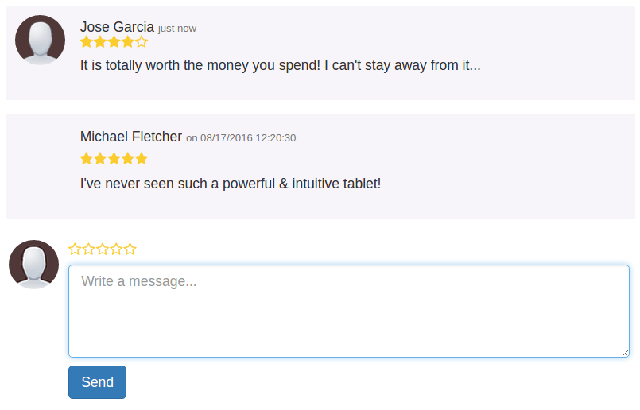
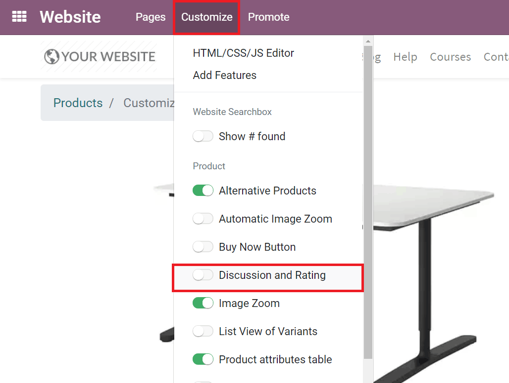
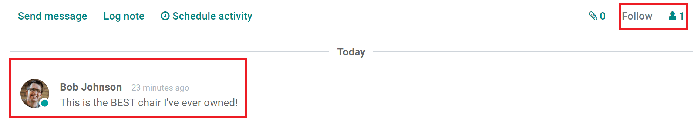
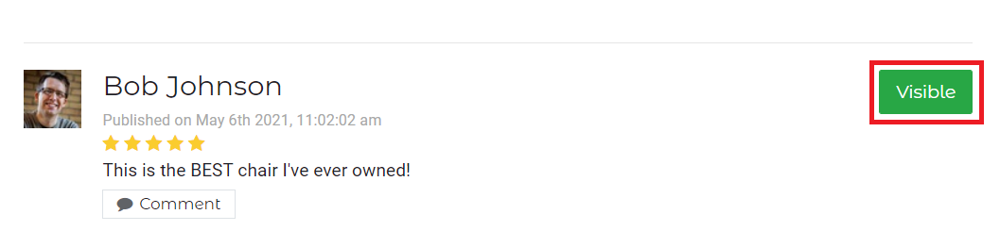
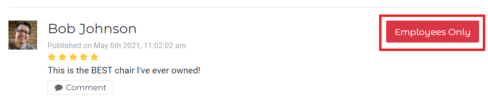
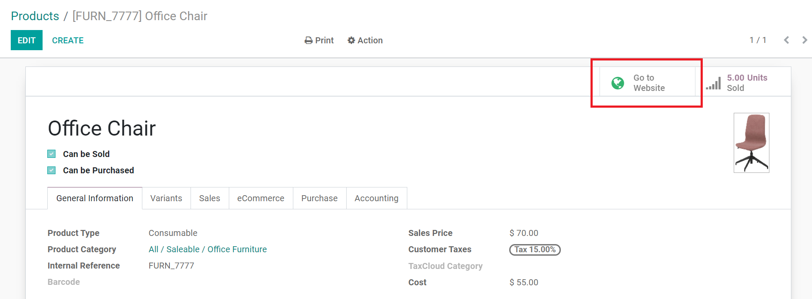

=========================
Enable comments & ratings
=========================

You can give your customers the opportunity to share their thoughts, feelings, and opinions about
your products (and the overall shopping experience) with just a couple of clicks. These opinions
and ratings can help you make more informed business decisions.

Setup
=====

First, navigate to a product page, and select :menuselection:`Customize --> Discussion and
Rating`. That activates the comments and ratings feature.

.. note::
    Visitors must log in to share their comments.
    (see :doc:`../../../websites/ecommerce/shopper_experience/portal` ).

Review posts in real-time
=========================

Whenever a post is published, the product manager (and all the product followers)
get notified about it. Also, the comment/review shows up in the *Chatter* on that product's
detail page.

In the upper right corner of the *Chatter*, you are able to follow the product itself (if you
aren't already) and see how many followers this product already has.

.. note::
    By default, the user who created the product is set as a follower.

Moderate & unpublish
====================

You can easily moderate comments and reviews by using the *Chatter*, either in the product detail
form or on the web page.

To unpublish the post, open the product web page and click the *Visible* button
to turn it red (*Employees Only*).

..  tip::
    You can access the web page from the detail form by clicking the *Go to Website*
    smart button.

