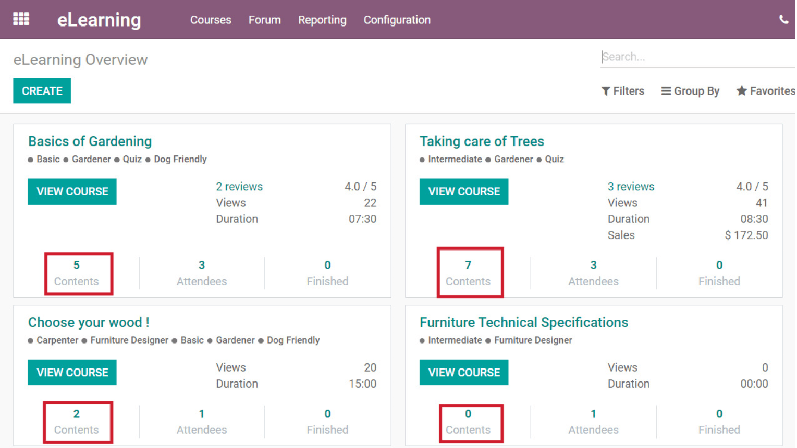
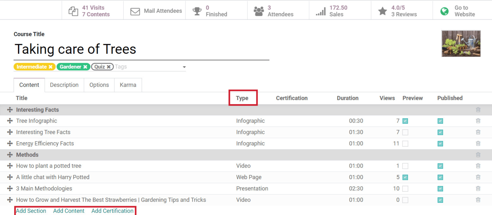
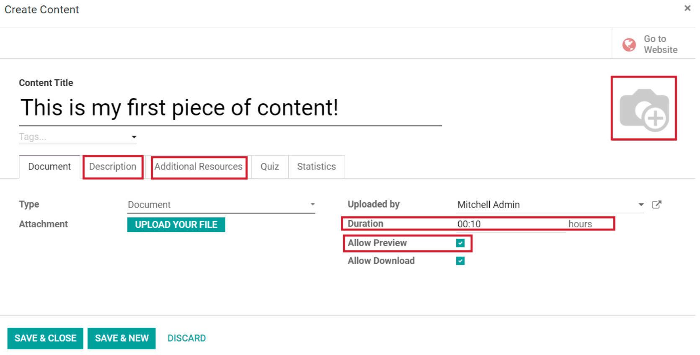
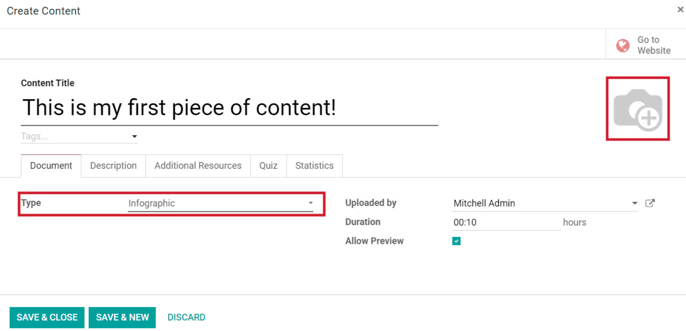
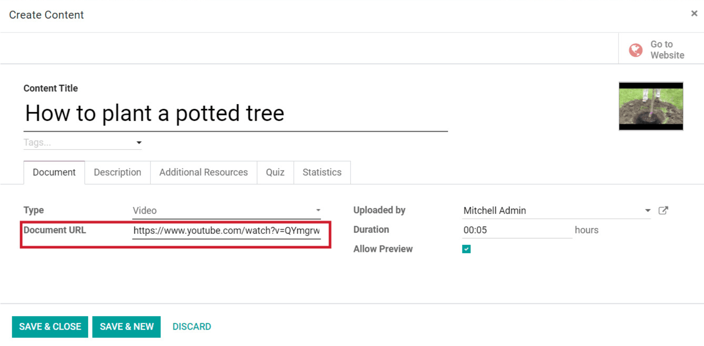
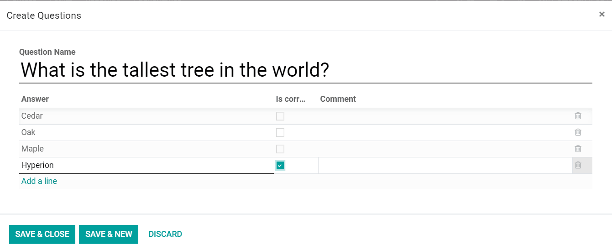
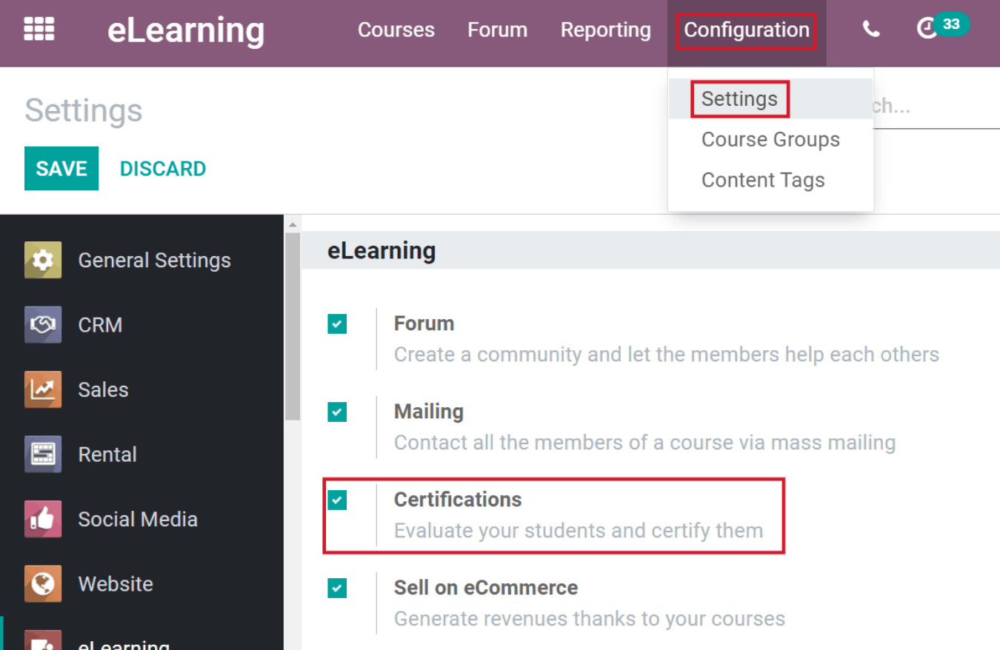

===========
Add content
===========

As you build your Odoo eLearning course, you can utilize all sorts of content to create an
engaging, informative, and interactive course for your participants to enjoy.

Configuration
=============

Each piece of content is specific to each course. Remember, you can find all your courses on the
eLearning dashboard, or by going to :menuselection:`Courses --> Courses` in the header menu.

When you find the course you wish to add content to, simply click on the course title, and Odoo
redirects you to the course template page. There, you’ll be able to add content.

You could also click on *Contents* in the corresponding course from the dashboard. When you do,
Odoo takes you to the *Contents* overview page, where you can create content for that course.

Add content
===========

Adding content is one of the first things you’ll do when creating an eLearning course. Simply click
on *Add Content* located at the bottom of the *Content* tab.

By default, all new content that’s added to your course appears in the last position. However,
you can quickly reorder and rearrange the content (and sections) of your course by clicking the
arrows to the left of the content, then dragging and dropping it wherever you please.

Each piece of content is classified by *Type*, which is clearly displayed in the *Content* tab.

Content options
~~~~~~~~~~~~~~~

-  You can add a picture for each piece of content, except for infographics because that image is
   the content, itself.

-  Feel free to write a brief description of the content, which will be visible on your website.

-  "Additional Resources" allows users to add as many links to their content as they want.

-  The "Allow Preview" feature allows anyone to view the course, even if they aren’t enrolled in
   the course.

-  The “Duration” is the amount of time it takes to complete the specific piece of content. The
   sum of *all* content durations create the overall duration of the course.

Content types
=============

Here's a quick breakdown of the various types of content you can use for your course.

-  **Infographic** Informative visual representations (i.e. charts, diagrams, etc.) that enrich your
   eLearning course. They *must* be .png files uploaded directly through the photo icon. This
   displays the image you’ve chosen as your infographic to your participants.

-  **Web Page** Utilize an entire web page as part of your course.

-  **Presentation** Upload any .ppt document to your course.

-  **Document** Upload documents, like .pdf or .docx files, directly to your course.

-  **Video** Odoo only supports videos uploaded with a YouTube URL. Simply copy and paste the
   YouTube URL in the **Document URL** field, and Odoo fills in the rest of the information
   automatically.

.. seealso::
   - :doc:`private-youtube`

-  **Quiz** Users can create a quiz for every single piece of content in their course. The quiz is
   always multiple choice, and participants can earn points for correct answers. Users decide how
   many points will be rewarded for these answers. There is no limit to the number of questions
   each quiz can have.

-  **Certification** Including a *Certification* adds value to your eLearning course. In order to
   utilize certifications, you’ll need to activate that feature in the
   eLearning settings.
   Go to :menuselection:`Configuration --> Settings --> Activate Certifications`.

.. seealso::
   - :doc:`certifications`

.. note::
   The *Odoo Surveys* module is **required** for *Certifications* to work.
