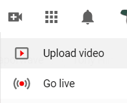
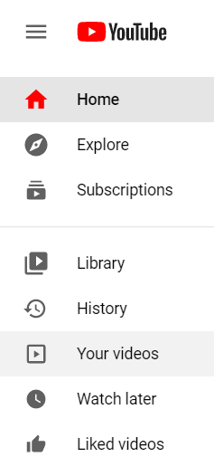
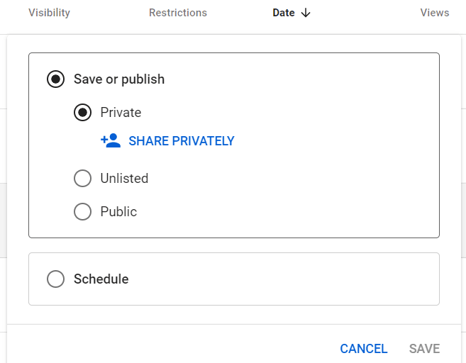
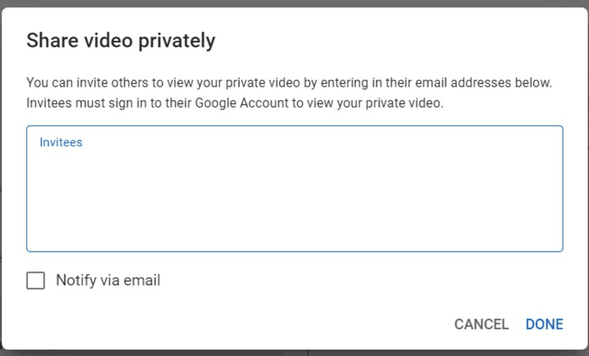

=================================
Make videos “Private” on YouTube
=================================

There are many reasons one may choose to make a video “Private” on YouTube. Perhaps, it’s not a 
finished product, contains privileged information, or has specific content meant for a specific 
audience. Whatever the case may be, you can easily set a video to “Private” on YouTube, once you 
have uploaded it to your channel. 

Videos
======

Once you’ve successfully created a YouTube account, you can start to upload videos.

To do that, you’ll need to select the *Create* icon in the upper right corner. Then, select
*Upload Video* from the drop-down menu.

Or, if you already have content uploaded that you want to make “Private,” click on *Your Videos*
in the sidebar.

This takes you to the *Channel Content* page of the YouTube Studio, where you can find all of your
content.

While on this page, find the video that you’d like to make “Private,” click on the
*Visibility* section, and select *Private* from the pop-up.

Then, you can click *Share Privately* and another pop-up appears, in which you can enter the
email addresses of people that you want to share this video with, and YouTube will take care of the 
rest.

