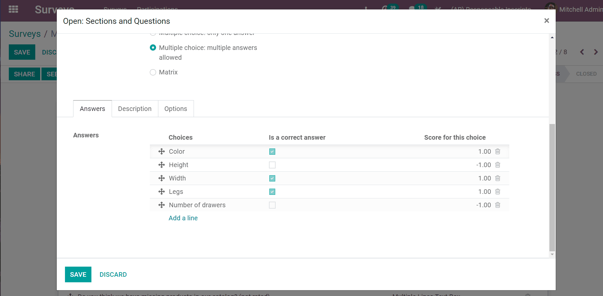
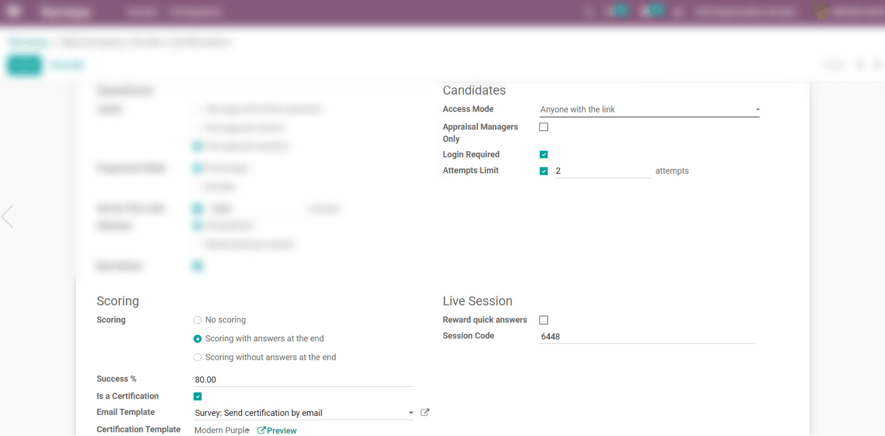

===============
Scoring surveys
===============

To measure your participant’s performance, knowledge of a subject, or overall satisfaction,
you can attach points to the answers of specific questions. The points are summed up to give your
participant a final score.

On your survey’s form, click on *Add a question* and (under the *Options* tab) you can choose
between *Scoring with answers at the end* or *Scoring without answers at the end*. Then, on your
question’s form, you can set the right answer and score.

Set the percentage score that the user will need to achieve in order to have successfully taken the
survey. If enabling *Certificate*, choose its template. The certification is automatically sent
by email to the users who successfully finish it.

You will need to enable *Login required* in order to *Give Badges*. Badges are related
to the eLearning section of your website. Besides the logged-in user, visitors of the website
that access the *Courses* page can also see the granted badges.

.. image:: media/frontend_bagdes.png
   :align: center
   :alt: View of the courses tab emphasizing the latest achievements section on the website for
         Odoo Surveys
