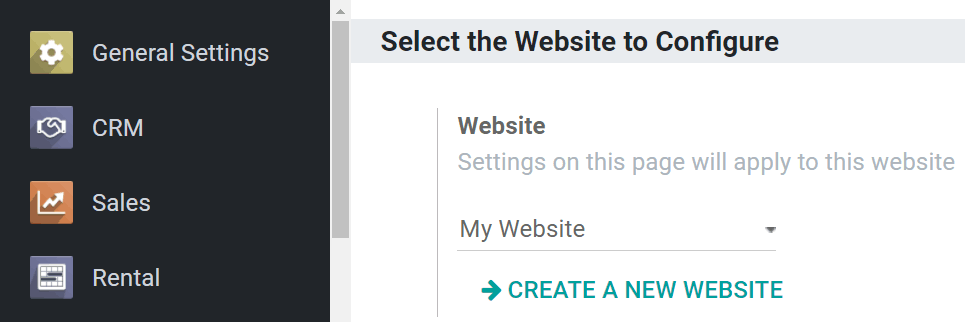
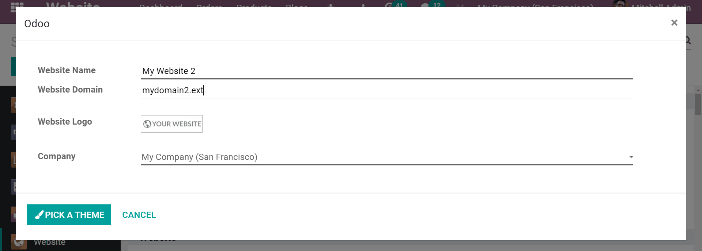
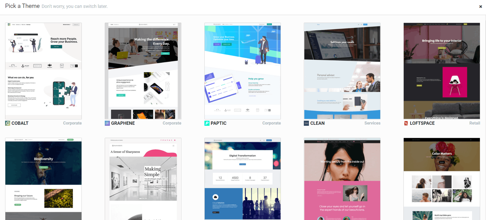
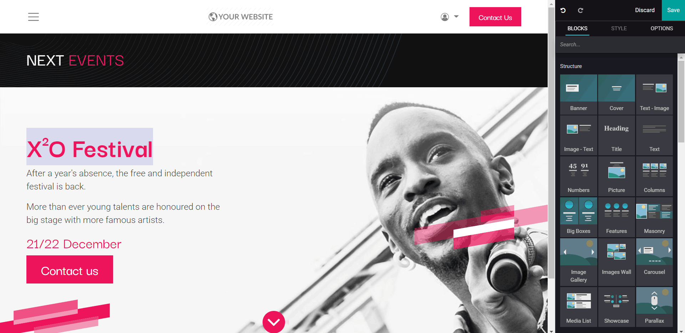
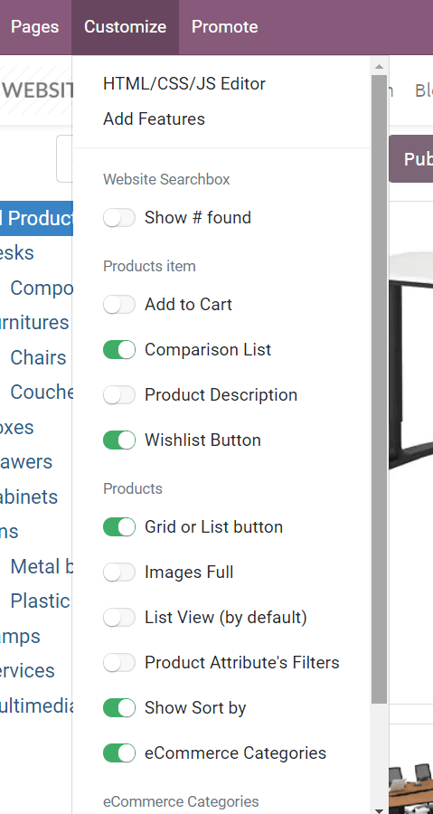
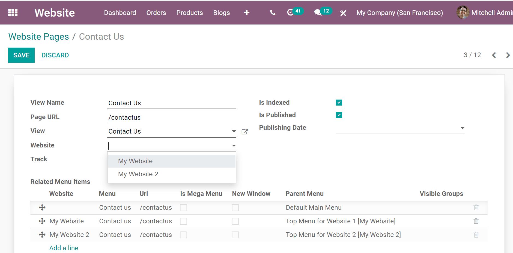
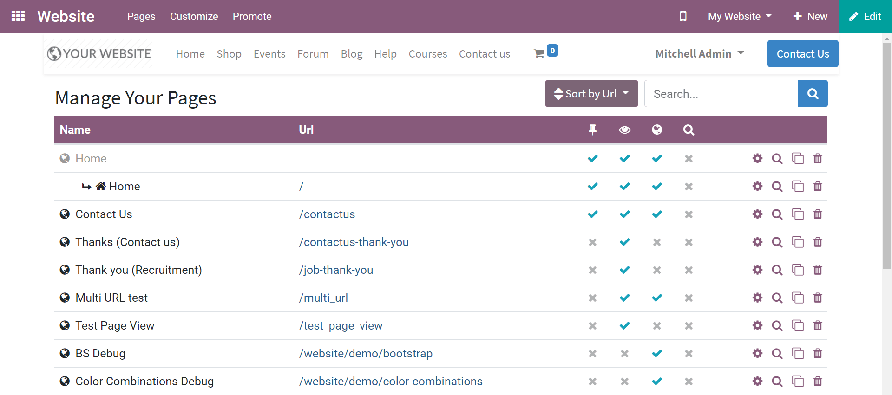
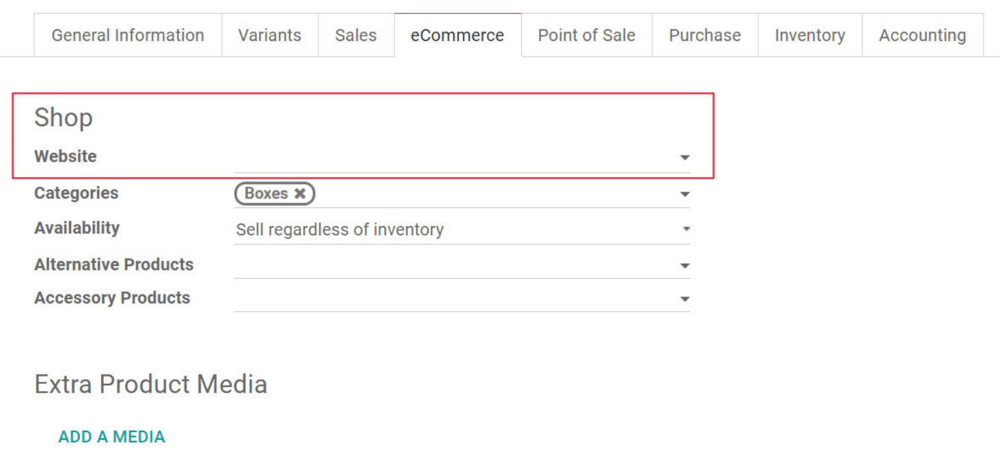
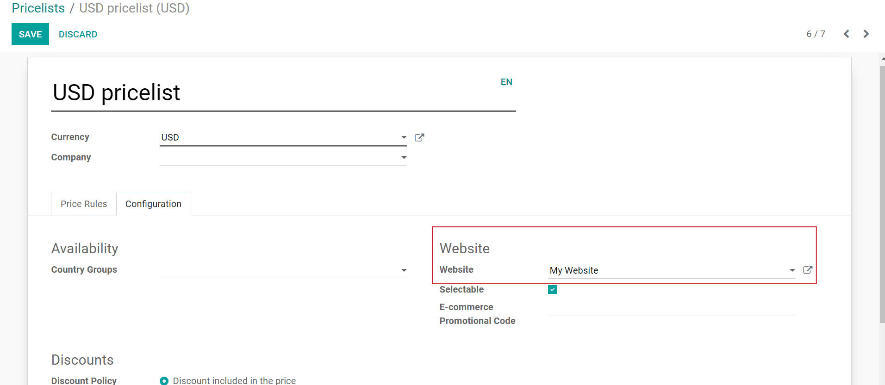

========================
Manage multiple websites
========================

.. image:: media/multi_website04.png
   :align: center
   :alt: various website themes

Odoo’s Multi-Websites feature opens up broad possibilities of diversification and
customer segmentation for any business. Multiply your audience and
boost revenue with just a few clicks!

Each Odoo website can work in a fully independent way, with its very own theme,
branding, domain name, header & footer, pages, languages, products, blog
posts, forums, slides, events, live chat channels, etc.

Let’s go for a tour!

Setup
=====

To create a new website, go to :menuselection:`Website --> Configuration --> Settings`.
The button, *Create a new website*, is  in the first section (*Select the Website to Configure*).

A pop-up will appear, in which you will set a name for your new website, along with a specific
domain name. Leave this field empty to publish the new website under the default
domain of your Odoo database. You can set country groups to
redirect visitors to it using Geo IP whenever you'd like.

Then, select *Pick A Theme*. This new website might have an entirely different
purpose (or audience) than the first one. So, feel free to go for a completely
different theme!

Once the theme is selected, you can start to build the homepage of your
website. Follow the purple drops; they will help you get started with 5 easy steps.

.. note::
   If you run Odoo Online, don’t forget to redirect any new domain name to your Odoo database
   (``CNAME``) and to authorize it on the Odoo-side. See :doc:`domain_name`.

Create the menu
===============

The new website has a default menu with all the installed applications.
To edit it, click :menuselection:`Pages --> Edit Menu`. Moving forward, you only edit
the menu of the current website.

Switch from one website to another
==================================

There is a website switcher in the right corner of the
edit bar. Switching to another website will connect to the domain of
this website. If you use another domain for the website, the user is
requested to sign in.

.. image:: media/multi_website03.png
   :align: center
   :alt: website switcher button in the corner

.. note::
   When switching, you are redirected to the same domain path on the other website
   (e.g., ``/shop/myproduct``). If this URL is not used, you will be redirected to a 404 page, and
   prompted to create a new page from there.

Add features
============

The website apps you install (like *Blogs*) are made available on
all your websites. You can, of course, keep them hidden in one website by
removing the menu item.

Each website comes with a high range of specific options in the
settings. First, select the website to configure.

.. image:: media/multi_website15.png
   :align: center
   :alt: selecting which website should be configured

Then, take a look at the options flagged with the earth icon. It means
they only impact the very website you are currently working on.

.. image:: media/multi_website12.png
   :align: center
   :alt: earth icon in the website settings menu

You can, for instance, set specific:

-  Languages

-  Domain names

-  Social media links

-  Dedicated live chat channels

-  Etc.

The other options are global and apply to *all* your websites.

Customize the visitor experience
================================

The customer experience can be customized in profound new ways, thanks to the
*Customize* menu. All the visual options available there are specific to
each website. Go through the different pages to adapt them to this new
audience. Focus on workflows and automatic pages (eCommerce checkout,
blogs, events, etc.), as the number of available options is higher there.

Publish specific content per website
------------------------------------

Like static pages, any content created from the front-end (product page, blog
post, etc.) is always *only* published on the current website. You can
change that from the edit form view in the backend, and leave the
*Website* field blank. This will publish it on all the websites.

.. image:: media/multi_website06.png
   :align: center
   :alt: publishing content on a specific website

Here are all the objects you can link to *either (or all) websites*:

1. Products

2. Product Categories for eCommerce

3. Blogs

4. Slide Channels

5. Forums

6. Events

7. Job Positions

.. note::
    When you create the record from the backend and publish it,
    typically a product or an event, it is made available on all websites.

Publish a page on all websites
------------------------------

When a new static page is created, it's only made available on the current
website. However, you can duplicate it to other websites from
:menuselection:`Website --> Configuration --> Pages`. To do so, leave the *Website* field empty.

If you want to duplicate it in just one other website, duplicate the
page and set the new website.

When you edit the page again, the change only affects the current
website. A new page is duplicated and tied to the website.

To better manage your pages, you can click on *Manage Pages* under the *Pages* drop-down menu
found on the front-end of the website.

.. tip:: 
      By grouping pages by URL in the page manager, you quickly find
      the original page behind each edited page.

.. image:: media/multi_website10.png
   :align: center
   :alt: detailed look at the manage pages section

Multiple companies
==================

Each website can be linked to a specific company of your system, in a
multi-companies environment. You can link each website to a company under the *Website* section
of settings in the Website application (*Configuration* > *Settings*).

.. image:: media/multi_website16.png
   :align: center
   :alt: choose which website to designate to a company

With such a configuration in place, only company-related data will appear on that
website (products, jobs, events, etc.).

Website editors can only view and edit the pages of the records they
have access to, which is typically the ones that belong to their current company
(and to their subsidiaries, or child companies in Odoo language).

.. note::
   If websites are multi-companies, you don’t change the company when switching websites. To
   change the company, and see the related content, use the company selector in the menu.

.. image:: media/multi_website02.png
   :align: center
   :alt: company selector drop-down menu

Configure eCommerce website
===========================

eCommerce is a crucial feature in the multi-websites environment. Odoo allows users to customize
the entire flow to fit the specific audience of each website.

Products only available on one website
--------------------------------------

We already saw earlier how to publish a specific record in only one
website. You will find the *Website* field in the eCommerce tab of the
product edit form. Empty means available in all websites.

Products available on select websites
-------------------------------------

To make a product available on some websites, but not all of them, you
should duplicate the product for each website.

If you need a unique reference to manage in your inventory, you should
install *Manufacturing* and create *Kits* BoMs (Bills of Materials).
Each kit will link each published “virtual” product to the main
reference managed in your inventory. That way, any item sold from your
website will be converted into the storable item in the delivery order.

Pricelists
----------

To manage specific prices by websites, you can activate *Pricelists* and *Multiple Sales
Prices per Product* in the *Pricing* section of *Website* settings. Then, hit *Save*.

Following that, go to :menuselection:`Website --> Products --> Pricelists` to create additional
pricelists. See :doc:`../../ecommerce/maximizing_revenue/pricing` if you need help.

Select a website to make a pricelist only available on that website, under the *Configuration*
tab of that desired pricelist.

Leaving the field empty means that it will work on *all* websites, if
*Selectable* is selected. Otherwise, it makes it only available for
backend operations of Sales and Point of Sale applications.

Payment Acquirers and Delivery Methods
--------------------------------------

By default, published payment acquirers and delivery methods are deployed in all websites.
You could already use specific payment acquirers per country (using Geo
IP) by defining countries in their configuration. Now, you can also do it
per website by filling in the *Website* field.

Customer accounts
-----------------

There is a setting to choose how to manage customer accounts in *Website*
settings. You can either allow customers to use one account through all
the websites or persuade them to create one account for each website. The ladder option is
convenient if your websites shouldn’t be related to each other in the visitor's mind.

.. image:: media/multi_website17.png
   :align: center
   :alt: specific user account in website settings

Technical hints for customization
=================================

If you want to publish custom objects on the website, here are a few
tips to make it work with multiple websites:

-  Sitemap: don’t forget the domain in the route to only publish
       available records in each website’s sitemap.

-  Access: you should call the method
       *can_access_from_current_website* in the controller to make
       sure the visitor can see a record in the current website.

-  Search: when a list of records is displayed, don’t forget to specify
       the domain to *only* display records available for the current
       website.

.. image:: media/multi_website11.png
   :align: center
   :alt: coding language of technical customization
