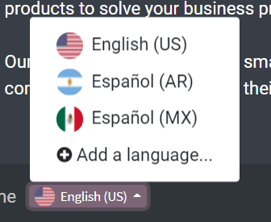
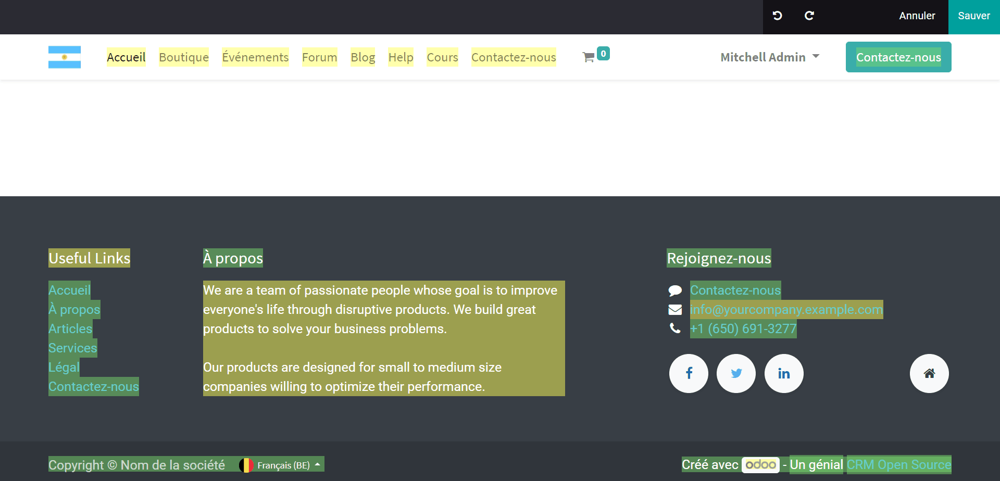

===================
Website translation
===================

In addition to creating beautiful, professional-grade web designs, Odoo provides users with the
ability to translate their websites into multiple different languages at any time.

Translate
=========

Once your website is created, you have the opportunity to translate it
into as many different languages as you want.

To do so, simply go to your website, and scroll down to your footer. Then, click on the language
(i.e. English - US) to reveal a menu, and click *Add a Language*.

Choose the language you want to translate to, and click *Add*.

.. image:: media/translate_website02.png
   :align: center
   :alt: add a language feature

Once you navigate back to your website, you'll see that new language option next to your initial
language (like, French, for example). This means *that* language translation for
this page has been created. When selected, you'll see that some of the text has been translated
automatically.

.. image:: media/translate_website03.png
   :align: center
   :alt: new language option available

To translate the content of the website, click on **Translate** (here, it's
**Traduire**, since we are translating the website in French).

.. image:: media/translate-button.png
   :align: center
   :alt: translate button

At this point, you will see that most of the content is highlighted in yellow or green. The yellow
represents the content that you have to translate manually. The green represents the content that
has already been translated automatically.

